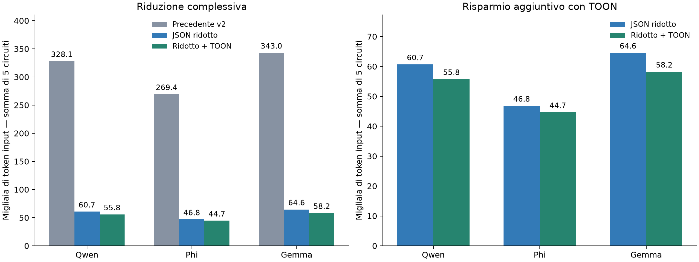

# Prompt originale, ridotto e ridotto con TOON

19 settembre 2026. Cinque circuiti train, cinque esempi RAG per richiesta. Nessuna nuova inferenza.
La misura riguarda i token di ingresso dei prompt preparati, non i token delle risposte o il consumo delle future correzioni.

## Risultato complessivo

Totali sui cinque circuiti, calcolati separatamente con il tokenizer di ciascun modello.
| Modello | Precedente v2 | JSON ridotto | Ridotto + TOON | Risparmio aggiuntivo | Riduzione rispetto a v2 |
| --- | --- | --- | --- | --- | --- |
| Qwen | 328.123 | 60.687 | 55.762 | 8,12% | 83,01% |
| Phi | 269.360 | 46.844 | 44.670 | 4,64% | 83,42% |
| Gemma | 343.014 | 64.578 | 58.249 | 9,80% | 83,02% |



## Che cosa significa originale

La colonna «Precedente v2» è il formato usato prima della riduzione dei contenuti: conservava QASM, provenienza e riferimenti multilivello, pur usando già alias e una codifica reversibile. È lo stesso riferimento del precedente confronto 34.318 → 11.667 token per Qwen/DJ.
Le richieste v2 sono ricostruite sui medesimi esempi con il vecchio serializzatore; original_v2_kind nel rapporto indica quali coincidono esattamente con una richiesta storica. Non vengono presentate come nuove inferenze.
La colonna «JSON ridotto» corrisponde alle richieste reali delle prove qwen-prompt-v3-01, phi-prompt-v3-02 e gemma-prompt-v3-01, tutte al primo tentativo.
La colonna «Ridotto + TOON» contiene le nuove richieste preparate, non ancora inviate.
Per distinguere anche il formato anteriore agli alias, abbiamo contato un quarto riferimento JSON senza alias, ricostruito con la vecchia regola esatta del grafo completo. Totali:

| Modello | JSON senza alias, ricostruito |
| --- | --- |
| Qwen | 544.395 |
| Phi | 421.703 |
| Gemma | 564.463 |

## Come è configurato TOON

È installato @toon-format/toon 4.1.1, dal progetto ufficiale https://github.com/toon-format/toon. Node 22.23.2 e il pacchetto sono locali al progetto e fissati con impronte e lockfile. L'ambiente Python MQT, uv.lock e i modelli addestrati non sono stati modificati.
La conversione diretta del JSON in TOON aumentava i token. Sono conservate le prove con virgola, tab e barra verticale, tabelle di archi e diverse disposizioni delle feature. La scelta finale usa virgole e due spazi di rientro.
Le 49 feature sono in una tabella con una riga per caratteristica e colonne current, E1...E5. Ogni zero e valore originale è conservato: non si selezionano feature e non si arrotondano numeri.
I collegamenti hardware sono liste ordinate di vicini per qubit sorgente, solo quando questo conserva esattamente l'ordine originale degli archi. In caso contrario resta la lista originale. La topologia completa mantiene la precedente regola esatta.
Ogni richiesta viene decodificata e ricostruita automaticamente prima dell'invio. Se un valore cambia, la richiesta viene bloccata. Le forme di feature non uniformi mantengono la struttura originale.
Lo schema della risposta resta JSON e il validatore resta invariato. Anche i messaggi correttivi sono conservati. QASM e metadati canonici restano fuori dal testo LLM e disponibili nei registri.

## Metodo di misura e limiti

Conteggio nativo con llama-tokenize.exe b10930 e i tre GGUF Q8_0 originali. Il testo comprende il template di chat di ciascun modello, le istruzioni TOON, i dati, lo schema leggibile e la checklist. Lo schema json_schema passato separatamente al server vincola l'uscita e non aggiunge token al testo.
Per ciascuno dei 15 casi, l'intera sequenza di token della base JSON coincide con quella archiviata dal server. Le percentuali aggregate usano il rapporto tra le somme, non una media delle percentuali.
Queste misure non dimostrano che TOON migliori la qualità delle scelte, la latenza o le correzioni. Servono le nuove prove train. Non sono stati avviati validation, test o training sperimentale.

## Dettaglio per circuito

| Modello | Circuito | Precedente v2 | JSON ridotto | Ridotto + TOON | Risparmio su JSON |
| --- | --- | --- | --- | --- | --- |
| qwen | ae_indep_qiskit_60 | 75.193 | 11.382 | 10.436 | 8,31% |
| qwen | dj_indep_tket_2 | 34.318 | 11.667 | 10.771 | 7,68% |
| qwen | portfoliovqe_indep_qiskit_6 | 36.265 | 12.692 | 11.718 | 7,67% |
| qwen | su2random_indep_qiskit_50 | 90.831 | 12.458 | 11.403 | 8,47% |
| qwen | su2random_indep_tket_50 | 91.516 | 12.488 | 11.434 | 8,44% |
| phi | ae_indep_qiskit_60 | 59.791 | 8.657 | 8.259 | 4,60% |
| phi | dj_indep_tket_2 | 28.506 | 9.063 | 8.733 | 3,64% |
| phi | portfoliovqe_indep_qiskit_6 | 29.961 | 9.853 | 9.436 | 4,23% |
| phi | su2random_indep_qiskit_50 | 75.207 | 9.636 | 9.121 | 5,34% |
| phi | su2random_indep_tket_50 | 75.895 | 9.635 | 9.121 | 5,33% |
| gemma | ae_indep_qiskit_60 | 77.738 | 12.078 | 10.784 | 10,71% |
| gemma | dj_indep_tket_2 | 37.296 | 12.395 | 11.169 | 9,89% |
| gemma | portfoliovqe_indep_qiskit_6 | 39.276 | 13.514 | 12.293 | 9,04% |
| gemma | su2random_indep_qiskit_50 | 93.871 | 13.280 | 11.986 | 9,74% |
| gemma | su2random_indep_tket_50 | 94.833 | 13.311 | 12.017 | 9,72% |

## Dati consultabili

I file sono in ../native_counts/<modello>/<circuito>/: original_v2.txt, minimal_json.txt, minimal_toon.txt, original_full_json.txt, data.toon, schema, input canonico e conteggi. prepared_request_not_sent.json conserva la richiesta nativa completa da provare.
Il rapporto leggibile da programma è ../native_counts/report.json. Il manifesto conserva le impronte. I tentativi storici rimangono intatti.

## Avvio delle prove

Dalla radice WSL, eseguire uno alla volta. Ogni comando prova i cinque circuiti train con p1_t0. La codifica TOON è già quella predefinita.

```bash
.venv/bin/python -m llm_selection.controller --technical --model qwen --label "qwen-toon-01" --precision Q8_0 --context 147456
```

```bash
.venv/bin/python -m llm_selection.controller --technical --model phi --label "phi-toon-01" --precision Q8_0 --context 30000
```

```bash
.venv/bin/python -m llm_selection.controller --technical --model gemma --label "gemma-toon-01" --precision Q8_0 --context 30000
```

I risultati finiscono nelle nuove cartelle technical_episodes/<etichetta>/; ogni encoding.json registra minimal-v3-toon1-20260919 e la versione TOON. Usare altre etichette se questi nomi esistono già.
Non congelare lo studio di validation finché queste prove non sono concluse.

## Verifiche software

244 test superati. Coprono ricostruzione completa, zeri, precisione, archi diretti e ordine, caratteri speciali, forme non uniformi, assenza di RAG, correzioni e schema JSON. Un test iniziale confrontava tuple Python con liste JSON; è stato corretto confrontando lo stesso modello di dati JSON. I log restano conservati.
La prima installazione npm da Windows sul percorso UNC ha fallito; è riuscita con Node Linux locale al progetto. La procedura riproducibile è .venv/bin/python -m llm_selection.setup_toon.
